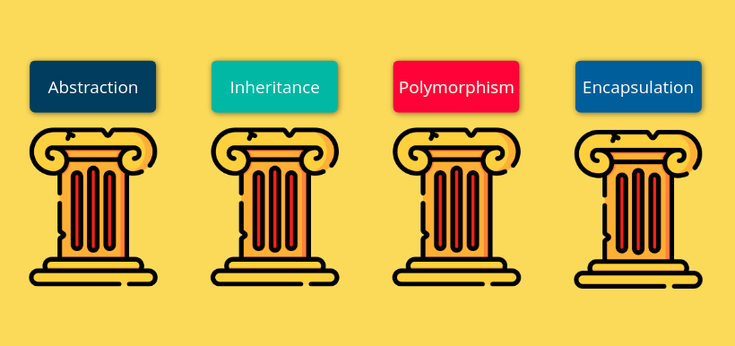
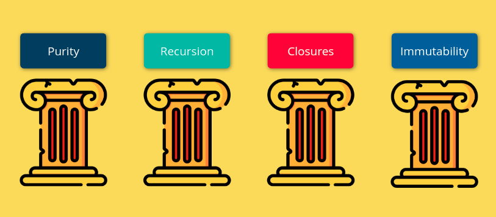

# What are the four pillars of functional programming?

If you've ever structured your code in object-oriented way you surely have come cross by the word "four pillars of OOP"

I will not go through every one of them, assuming you already know what they mean and the use cases of every one of them.

But what I am going through is that some of them are somehow implemented in functional programming as well, except that `inheritance` cannot be achieved through functions, and if we can't have inheritance between functions, surely we cannot have `polymorphism`, but the good trade-off that `functional programming` does have `abstraction`, `encapsulation` and its own pillars.

Functional programming has also 4 pillars of its own and each one of them poses a high importance.

## Functions purity

We'll have a full section going through the purity of a function, but briefly, a pure function is a function that does not cause any `side effects` and that's also another topic we'll go through.

## Recursion

Surely you're familiar with the word `recursion` and `recursive functions` and I assume that infers that recursion is only a functional thing, you cannot have recursive class or a recursive entity, only functions can achieve recursion.

We'll have a full section as well, discussing every possible inch of recursion and how to optimize our recursive functions, so they consume less memory and less time.

## Closures

Closures are the most powerful concept exists, even you code in functional-programming style or an object-oriented style, you surely have used closures, even if you've never made any closure function, you're using them in the core of language itself.

Closures is the base of almost everything that JavaScript has.

## Immutability

Functional programming is all about having pure functions, so you should preserve immutability which is not modifying your data through your functions.

This concept of separating state modifications and function definitions gives you a huge performance boost, if you're using [React.js](https://reactjs.org/) you surely have been through the `Immutable data structures` which makes your components more performant.

So throughout our course we'll walk through every pillar of them and explain each one of them deeply and how to implement each one of them.

 
 
 

## Don't forget to follow us to stay updated with everything.

 

