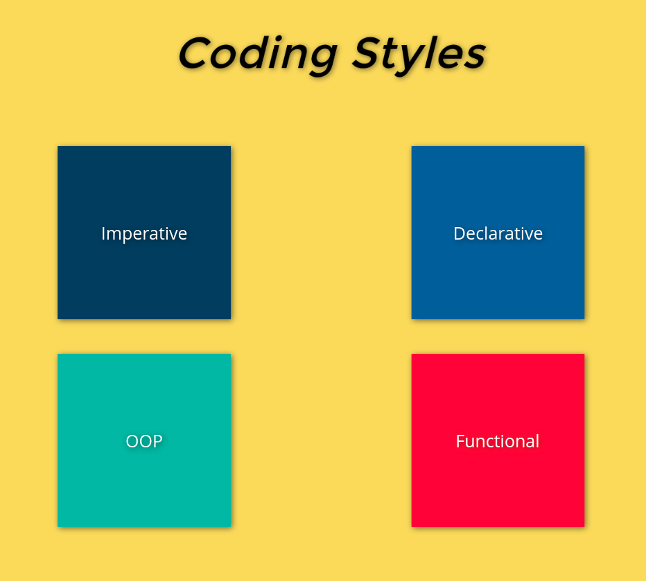

# Coding styles.

There exist four types of coding styles as shown in the previous figure, or to be more specific, two of them are coding styles and the other two are structural paradigms.

 

## Imperative programming

The imperative coding styles is the way the computer performs any task, for instance if you want to open some folder or play a song.

You'd go execute it by telling your computer play that song or open a Google Chrome tab, hit to YouTube, search for my song, play it.

That's how the imperative way goes like, performing your task in some sort of orders, do that, then do this, therefore, I'd like to define the imperative coding style as the following:

> The imperative coding style is a way of telling the computer (or the code) to do your task in “Follow don't think” manner, where you give the computer successive orders to execute.

Note: check `imperative.js` and `imperative.ts` files attached for code examples

 

## Declarative programming

The declarative programming is a coding style which is more abstract than the imperative programming, the same example as before, if you want to open a folder or play a song.

In a declarative way, you'd just let the computer know that you want to play a song, and that's it, you'll trust the computer's judgement to play the song for you.

You'll not be concerned with the smallest of details of how this task is performed, but you've just `declared` a task to the code to perform.

Therefore, the declarative programming is somehow more abstract than the imperative programming, as you're separating concerns of how the task is performed (code complexity) and the data flow by which the code will be executed, So let's define declarative programming as the following:

> Declarative programming is some sort of coding style by which you tell your computer (or the code) to do your task, and just only inform the computer of what data it needs to do the task not how it should do it, some sort of “Do it your way” manner.

Note: check `imperative.js` and `imperative.ts` files attached for code examples

 

## Object-Oriented Programming

The OOP paradigm is widely known and used, I may even assume that you come from an OO background and just thought about shifting to FP.

Regardless the features that OOP provides, we discussed earlier that there are alternatives and some of them are implemented in FP.

In my opinion, I believe that OOP is useless with apply FP to its methods, imagine that you're having a `User` entity that's responsible for all user actions in your website.

If you'd structure this `User` entity in OO way, surely you'd need at some point to separate all the methods into smaller entities maybe as the following: `Register`, `Login`, `Logout`, `AddPost` ... etc.

In some sense, your will end up having a lot of methods in your `User` model, right?

And following the clean code standards, you'll have to separate all those methods so, your class is applying some `SOLID` principles and clean code standards.

So, if you'll end up separating your methods into smaller methods which will represent smaller units, why won't you implement the FP ?

That's the way of thinking I'd like you to start following throughout this course, that FP is not a replacement for OOP, but a completion where you should implement both of them when you find it most useful.

 

## Functional programming

This is what we're going to know throughout this course.

 
 
 

## Stay tuned, and don't forget to follow us to stay updated ^^

 

