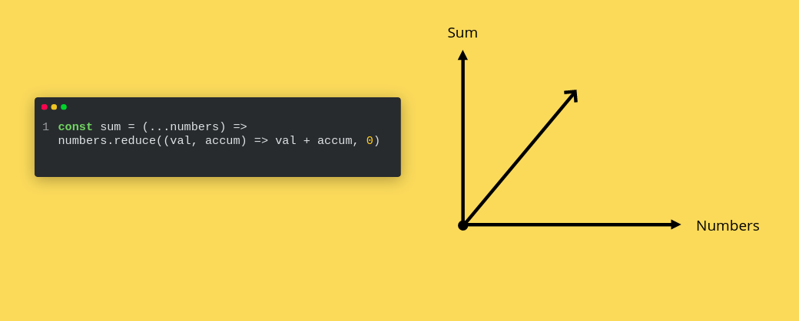

# Do you really know functions?

Our programs never run out of functions, I may assume that you write functions 24/7 whether they’re methods or procedures or even helper functions.

That’s a fact stated that our programs are just a set of functions and data flowing through these functions from one to another, so we can achieve some certain goal like maybe adding records into a database or fetching some data from Restful API, or more logically, some manipulation that adds this very article to the web page, so you can read it like any other content.

**But do we really write functions? I question that actually…**

But what I question further, do you really know what is a function?
According to the mathematical definition of functions.

> An expression, rule, or law that defines a relationship between one variable (the independent variable) and another variable (the dependent variable).

Hmm, that doesn’t really sound like an easy definition to grasp your head around from the first glance. But, if you apply this very definition to any of the functions that you daily use/write you would realize that you’re not typing functions at all!! Most of your program isn’t made of functions.

**So, what is a function according to that mathematical definition?**

Well let’s say that a function is just a relationship, some sort of bond between data, I am quite sure you’re familiar with the equation `x = y+2`.
Surely, that’s some sort of easy-peasy equation from the first math grade you would’ve taken I assume.

<br>
<a href="https://www.udemy.com/user/sec-theater/">
  
</a>
<br>
<br>

But in a matter of fact, this `function` is truly a function, which might sound weird, how a function cannot be a function? What would it be then?
If we apply the mathematical definition we stated earlier, a “function” is an expression “bond” that defines a relationship between one variable “x” and another variable “y”.

And that’s exactly what our cutie function does, it defines the relationship between x and y as the following: whenever y increases/decreases, x increases/decreases the same amount + 2.

Duh, I bet the math made you sick already, let’s get to programming.
Projecting that mathematical definition of functions to our JavaScript functions, a function to become a true function, must apply to some rules that only functions have.

1. A function must have an output
2. Function name must be semantic
3. There must be an obvious relationship between functions’ inputs and outputs

Umm, those three rules may not be anything new to you, but how many times have you violated them?
Actually, if you never returned in a function, that’s not a function, that’s called a procedure.

So let us define functions once again using a more understandable definition

> A function is a process that is done on some certain data that the function receives through its inputs (parameters) and return them to the outside world as outputs.

```js
function add(x, y) {
  return x + y
}
```

This function applies the three rules that we have stated earlier
First, it surely sends an output out of its execution context, secondly, its name is referring to what it’s doing, lastly, there’s an obvious relationship between the inputs (parameters) and the output (returned value) that whenever the inputs increase, the output increase. They’re directly proportional.

**Then what would I call a function that doesn’t apply the three conditions stated earlier?**

Those are called procedures, where procedures are defined as the following

> A procedure is a set of instructions or operations that are done successively on some sort of data that may not be directly passed through the function body to interact with the outside world of the function.

Projecting this definition, hitting RESTful APIs, manipulating DOM elements, interacting with databases, and most of your daily programming actions.

```js
const coords = {
  x: 10,
  y: 12,
}

function increaseHorizontalAxis(amount) {
  coords.x += amount
}

console.log(coords) // {x: 10, y: 12}
increaseHorizontalAxis(2)
console.log(coords) // {x: 12, y: 12}
```

Most of the procedures are considered as impure functions, which is a topic for another time, but our programs never run out from procedures, don’t they?
That’s what you should stop doing, or decrease the usage of procedures and start implementing real functions, that would be your first step in applying the functional programming paradigm is actually using functions not some facade of it.

You can never use 100% of functions all overall your program, you’ll surely need procedures to add data to databases, fetch data from RESTful APIs, manipulating the DOM object, and even more. But, the key point is that you reduce the usage of procedures and increase the implementation of pure functions which will make your code much productive, effective, and much easier to debug and test.

<a href="https://github.com/ahmedosama-st/the-real-functional-javascript/tree/master/manuscript-free-sample/section-1-introduction/lecture-3-coding-styles">
  
</a>

<a href="https://github.com/ahmedosama-st/the-real-functional-javascript/tree/master/manuscript-free-sample/section-2-functions/lecture-2-side-effects">
  
</a>

<br>
<br>
<br>

## Stay tuned, and don't forget to follow us to stay updated ^^

<br>

[](https://www.facebook.com/SecTheaterEG)
[](https://t.me/sectheater)
[](https://discord.com/invite/4VqCstahAR)
[](http://youtube.com/c/SecTheater/)
