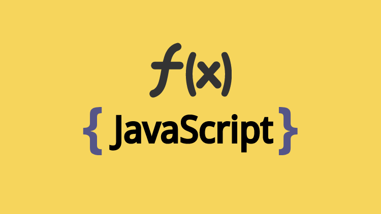

# The real JavaScript: Functional Programming

This is the official repository for my course “The real functional programming in JavaScript”. Read a sample here online **for free**, or buy from:

This repository is made to be your guide during the course and your reference after finishing it as it will contain each file used in any lecture in `.js` and `.ts` versions (if possible)

If you'd like additionally to contribute financially towards the effort (or any of my other work) aside from purchasing the course, I do have a [Patreon](https://www.patreon.com/sectheater) that I would always appreciate your generosity towards.

  

## If you have any question about anything in the course or if you'd like to chat about any suggestions or anything, don't hesitate to contact us

  

  
  

## What you will learn from this course?

- Chapter 1 - Introduction

  - What is functional programming? [Read here](https://github.com/ahmedosama-st/the-real-functional-javascript/tree/master/manuscript-free-sample/section-1-introduction/lecture-1-what-is-functional-programming)
  - The four pillars of FP [Read here](https://github.com/ahmedosama-st/the-real-functional-javascript/tree/master/manuscript-free-sample/section-1-introduction/lecture-2-the-four-pillars-of-fp)
  - Coding styles [Read here](https://github.com/ahmedosama-st/the-real-functional-javascript/tree/master/manuscript-free-sample/section-1-introduction/lecture-3-coding-styles)

- Chapter 2 - Functions

  - Do you know functions? [Read here](https://github.com/ahmedosama-st/the-real-functional-javascript/tree/master/manuscript-free-sample/section-2-functions/lecture-1-do-you-know-what-is-a-function)
  - Side Effects [Read here](https://github.com/ahmedosama-st/the-real-functional-javascript/tree/master/manuscript-free-sample/section-2-functions/lecture-2-side-effects)
  - Pure functions [Read here](https://github.com/ahmedosama-st/the-real-functional-javascript/tree/master/manuscript-free-sample/section-2-functions/lecture-3-functions-purity)
  - Extracting and containing impurity
  - Higher order functions
  - Function shape and arguments
  - Equational reasoning and point free functions
  - Chapter review

- Chapter 3 - Higher order functions

  - What is a higher order function?
  - The map function under the hood & Implementing our own one
  - Implementing our own map function in a declarative style
  - The filter function under the hood & Implementing our own one
  - Implementing our own filter function in a declarative style
  - The reduce function under the hood & Implementing our own one
  - Implementing our own reduce function in a declarative style
  - The mapReduce function, implementing our own in a declarative way
  - Chapter Review

- Chapter 4 - Closures are the most powerful

  - Global, script and local scope
  - Block scope
  - Lexical scopes
  - Closures and why they are so powerful
  - Specializing functions by using partial applications
  - Specializing functions by using currying
  - Encapsulating and sharing state for functions
  - Memoization
  - Referential transparency
  - Shaping functions using currying
  - Module pattern
  - Chapter review

- Chapter 5 - Nesting functions (Function chaining)

  - The unix philosophy
  - Math && OOP philosophy
  - Functional programming philosophy
  - Piping and composition
  - Composition associativity
  - Revisiting point free

  - Chapter review

- Chapter 6 - Recursion

  - What is recursion, and what flaws it has?
  - Why to use recursion?
  - Recursion and call-stack are besties
  - The anatomy behind a recursive function
  - Recursion exercise and common mistakes to avoid
  - Why recursion is memory-expensive
  - Proper tail calls
  - Trampolines
  - Chapter review

- Chapter 7 - Immutable data structures

  - What is immutability?
  - Primitive immutability
  - Rethinking const keyword
  - Rethinking object.freeze
  - Copy, don't mutate
  - Immutable data structures
  - Immutable libraries
  - Chapter review

- Chapter 8 - Functors and lists

  - What is a functor?
  - A container functor
  - Revisiting map && filter
  - Revisiting reduce
  - Unique && uniqueMap implementation
  - Flat && flatMap implementation
  - Optimizing flat
  - Zip, flat, and sorting == merging arrays
  - Fusion and transduction
  - Transducer under the hood
  - Debugging transducers
  - Chapter review

- Wrapping up everything && next steps

## Prerequisites you should know before the course

- Basic knowledge of JavaScript syntax and little of ES6 updates
- It's recommended that you do understand what an [Execution Context](https://www.javascripttutorial.net/javascript-execution-context/) means, what is [Hoisting](https://developer.mozilla.org/en-US/docs/Glossary/Hoisting) and some of those fundamental concepts.

## Stay tuned, and don't forget to follow us to stay updated ^^

 

